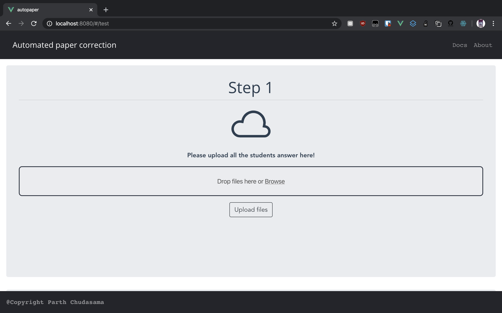

# Automated-paper-correction

End to end solution for hassle free paper correction, for universities/teachers/students

## Usage

Clone the repo

    git clone https://parthchudasama@bitbucket.org/parthchudasama/paper-correction.git`
	cd paper-correction


## Installation
**We suggest you create a new envionment**
```bash
pip install -r requirements.txt
```
## Run

```python
python app.py
```
The app will be available at  `127.0.0.1:5000/`

## Application description 
The application is divided in to 4 step
### Step 1
# Automated-paper-correction

End to end solution for hassle free paper correction, for universities/teachers/students

## Usage

Clone the repo

    git clone https://parthchudasama@bitbucket.org/parthchudasama/paper-correction.git`
	cd paper-correction


## Installation
**We suggest you create a new envionment**
```bash
pip install -r requirements.txt
```
## Run

```python
python app.py
```
The app will be available at  `127.0.0.1:5000/`

## Application description 
The application is divided in to 4 step
### Step 1

## License

[MIT](https://choosealicense.com/licenses/mit/)


## License

[MIT](https://choosealicense.com/licenses/mit/)
